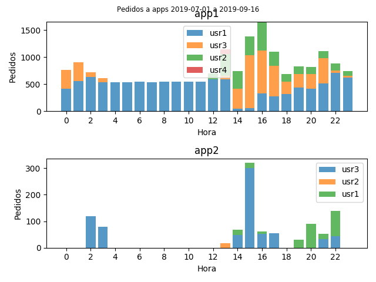

## Plots hours of the day usage for users analyzing nginx logs.

`collect.py` parses nginx access logs (they can be gzipped) and outputs a *.csv* file with three columns: *datetime, user, app*.
*app* is the subdomain (it assumes something like *subdomain.domain.com*).
*user* it assumes those apps are using HTTP authentication.

`plot.py` reads the *csv* file and creates a per app stacked bar plot showing requests per hour.

The generated graph is something like this:

It needs Python 3+.
